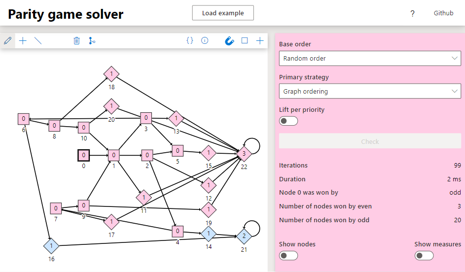

# parity-game-solver

This repository contains a TypeScript implementation of a parity game solver. This project also contains a [visual demo](https://tarvk.github.io/parity-game-solver/demo/build/) that allows for simple Parity games to be created or uploaded, and to be solved.

This parity game solver was created as an assignment for the 2IMF35 Algorithms for model checking course taught at the [TU/e](https://www.tue.nl/en/). The course only required us to make a very simple game parser, implement the [Small Progress Measures Algorithm](https://www.win.tue.nl/~timw/teaching/amc/2009/college14.pdf) with 2 custom lifting strategies, and create a command line interface. I however also decided to experiment with some more lifting techniques, and to reuse some code of the first assignment to als create a visual web-interface.

For more information, check out the [more extensive explanation on my website](https://tarvk.github.io/projects/model-checker), or the information in the visual demo.
